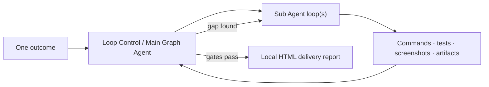

<p align="center">
  
</p>

<h1 align="center">LoopForge</h1>

<p align="center">
  <strong>Turn one sentence into verified software—or a durable local operation.</strong><br>
  A native macOS control plane for autonomous coding agents, dependency-aware multi-agent graphs, and self-healing local watchers.
</p>

<p align="center">
  <a href="README.md">English</a> · <a href="README.zh-CN.md">简体中文</a>
</p>

<p align="center">
  
  
  
  
  
</p>


LoopForge keeps long-running agent work moving without turning “autonomous” into
“unobservable.” It supervises official Codex, OpenAI-compatible APIs, or local
Ollama models; preserves checkpoints; audits real evidence; and delivers a
readable HTML result instead of stopping at an Agent claim.

## Contents

- [Why LoopForge](#why-loopforge)
- [Three workflows](#three-workflows)
- [Quick start](#quick-start)
- [How it works](#how-it-works)
- [Controls that matter](#controls-that-matter)
- [Models, privacy, and access](#models-privacy-and-access)
- [Validation](#validation)
- [Contributing](#contributing)

## Why LoopForge

- **Finish, do not merely answer.** Hard active-work targets, iterative audits,
  reproducible commands, visual evidence, and a final delivery gate.
- **Parallelize only when safe.** Auto Graph materializes work only after its
  predecessors are completed, integrated, and reviewed.
- **Stop paying an Agent to wait.** Continuum Watcher turns recurring work into
  a bounded local pipeline and wakes intelligence only for anomalies, reviews,
  adaptation, or completion.
- **Keep control visible.** Every instruction, iteration, checkpoint, branch
  replacement, blocked interval, and Main Agent decision remains inspectable.

## Three workflows

### Single Loop — ship or repair one outcome


Best for focused builds, bug fixes, migrations, optimization, experiments, and
test-coverage work. LoopForge repeatedly inspects the workspace and evidence,
then gives the Sub Agent the highest-value next instruction until the time and
quality gates both pass.

Examples: repair a persistence race · build a release-ready utility · reproduce
and optimize a slow path · establish an ML baseline.

### Auto Graph — coordinate a complex system


A Main Graph Agent creates only ready nodes. Independent nodes may run in
isolated Git worktrees; dependent nodes do not exist until the complete join
group is audited. Unsafe branches are retained as red, clickable history and
replaced with explicit provenance.

Examples: backend + native UI + migration · multi-module refactor · product,
test, documentation, and packaging work · complex research with converging
implementation.

### Continuum Watcher — automate the long tail


Codex first solidifies routine work into an idempotent one-pass program with
atomic telemetry and a durable checkpoint. A low-cost scheduler runs it; rules,
staleness, failures, thresholds, or periodic review wake the Agent to diagnose
the live state and improve the pipeline itself.

Examples: service and security anomaly monitoring · large batch processing ·
condition tracking and notification · scheduled data-quality checks.

## Quick start

### Download the app

1. Download `LoopForge-macOS-arm64.zip` from the
   [latest release](https://github.com/godicewang/LoopForge/releases/latest).
2. Unzip it and move **LoopForge.app** to `/Applications`.
3. Open LoopForge, grant only the capabilities your work needs, and connect with
   the existing Codex/ChatGPT sign-in when prompted.

LoopForge v1.0 targets Apple Silicon and macOS 14 or later. The community archive
is ad-hoc signed; until a notarized Developer ID build is published, macOS may
require **Control-click → Open** on first launch.

### Build from source

Requirements: Xcode Command Line Tools, `curl`, and Apple Silicon.

```bash
git clone https://github.com/godicewang/LoopForge.git
cd LoopForge
zsh Scripts/bootstrap_vendor.sh
zsh Scripts/package_app.sh
open dist/LoopForge.app
```

The bootstrap script downloads pinned official Codex and Ollama release
artifacts and verifies their SHA-256 checksums. No model weights are bundled.

### Run the test suite

```bash
swift test
swift build -c release -Xswiftc -warnings-as-errors
```

## How it works



Only successful active Sub Agent time counts toward a hard target. Downloads,
control reviews, failed infrastructure turns, pauses, sleep, and app downtime do
not. State is atomically checkpointed and interrupted work recovers paused or
resumable without inventing runtime.

Auto Graph adds a stricter rule: a successor cannot be dispatched until every
required predecessor has completed, integrated, and passed Main Agent review.
The Main Agent sleeps on node signals instead of polling.

Watcher uses a different runtime: one bounded deterministic pass, then exit.
Telemetry, checkpoint, signal/rule cardinality, file size, subprocess output,
timeouts, and workspace paths are all bounded and validated before acceptance.

## Controls that matter

| Control | What it changes |
| --- | --- |
| **Task Quality** | Lightweight, Normal, Enhanced, or Ultra evidence depth |
| **Active runtime** | Suggested from the goal; editable before start |
| **Single / Graph / Candidates** | Sequential supervision, dependency graph, or isolated alternatives |
| **Loop Control Agent** | Plans, audits, recovers, and decides the next instruction |
| **Sub Agent** | Performs the scoped project work |
| **Full Access / Workspace Only** | Independent boundary for each role |
| **Pause Task** | Checkpoints and waits for the active process to exit safely |
| **End Task…** | Stops agent work while preserving the project and evidence |
| **Final Report** | Opens the local, self-contained delivery page |

## Models, privacy, and access

Both roles default to the newest model reported by the installed official Codex
CLI, strongest available reasoning, and Full Access. Each role can instead use:

- official Codex with the Mac's existing ChatGPT authentication;
- a saved OpenAI-compatible API connection;
- a user-downloaded Ollama model through the Codex OSS tool harness.

API keys are stored in macOS Keychain, not task JSON or command arguments.
Watcher child processes receive a minimal environment and cannot inherit
unrelated API/CI secrets. Local models are opt-in downloads with size,
capability, digest, and live-response checks. See [SECURITY.md](SECURITY.md).

## Validation

The v1.0 candidate completed two independent scenario passes:

- **17 comprehensive release scenarios** across Single Loop, Auto Graph, and
  Continuum Watcher;
- **5+ distinct Watcher workloads** in the first pass, followed by fresh
  pressure, timeout, recovery, and cardinality tests;
- **205 tests executed, 0 failures**, with 6 external credential/model/browser
  integrations explicitly opt-in.

The exact scenarios and defects found are documented in
[release validation](docs/RELEASE_VALIDATION.md).

## Contributing

Issues and focused pull requests are welcome. Start with
[CONTRIBUTING.md](CONTRIBUTING.md), review the
[security model](SECURITY.md), and follow the
[Code of Conduct](CODE_OF_CONDUCT.md).

LoopForge is an independent open-source project. It is not an official OpenAI or
Ollama product. Bundled third-party components retain their own licenses; see
[THIRD_PARTY_NOTICES.md](THIRD_PARTY_NOTICES.md).
