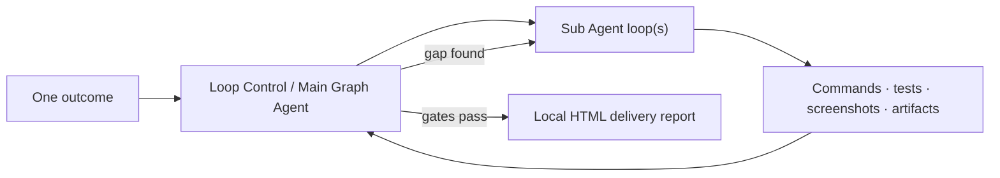

<p align="center">
  
</p>

<h1 align="center">LoopForge</h1>

<p align="center">
  <strong>Turn one sentence into verified software—or a durable local operation.</strong><br>
  A native macOS control plane for autonomous coding agents, dependency-aware multi-agent graphs, and self-healing local watchers.
</p>

<p align="center">
  <a href="README.md">English</a> · <a href="README.zh-CN.md">简体中文</a>
</p>

<p align="center">
  
  
  
  
  
</p>


LoopForge is a native macOS tool built around the Codex agent architecture for
finishing exceptionally long or complex work through three execution forms: a
fully autonomous Single Loop, a dependency-aware Auto Graph, and an adaptive
Continuum Watcher. It includes the official Codex and Ollama runtimes, and can
also use third-party APIs or opt-in open models downloaded locally.

**LoopForge is fully open source under the Apache 2.0 license.**

Give it one outcome and LoopForge keeps the selected workflow advancing
automatically—planning, executing, auditing, recovering, and issuing the next
instruction—while remaining visible, pausable, resumable, and inspectable. It
verifies real commands, artifacts, tests, and screenshots, then ends with a
local HTML delivery page instead of stopping at an Agent claim.

## Contents

- [Why LoopForge](#why-loopforge)
- [Three workflows](#three-workflows)
- [Delivery report](#delivery-report)
- [Quick start](#quick-start)
- [How it works](#how-it-works)
- [Controls that matter](#controls-that-matter)
- [Models, privacy, and access](#models-privacy-and-access)
- [Contributing](#contributing)

## Why LoopForge

- **Finish, do not merely answer.** Hard active-work targets, iterative audits,
  reproducible commands, visual evidence, and a final delivery gate.
- **Parallelize only when safe.** Auto Graph materializes work only after its
  predecessors are completed, integrated, and reviewed.
- **Stop paying an Agent to wait.** Continuum Watcher turns recurring work into
  a bounded local pipeline and wakes intelligence only for anomalies, reviews,
  adaptation, or completion.
- **Keep control visible.** Every instruction, iteration, checkpoint, branch
  replacement, blocked interval, and Main Agent decision remains inspectable.

## Three workflows

### Single Loop — ship or repair one outcome


Best for focused builds, bug fixes, migrations, optimization, experiments, and
test-coverage work. LoopForge repeatedly inspects the workspace and evidence,
then gives the Sub Agent the highest-value next instruction until the time and
quality gates both pass.

Examples: repair a persistence race · build a release-ready utility · reproduce
and optimize a slow path · establish an ML baseline.

Need alternatives rather than one answer? Enable **Parallel candidates**, choose
**2–8** results, and LoopForge runs each in an isolated Git worktree. The Agent
can retain the evidence-backed winner automatically, or leave the final choice
to you.

### Auto Graph — coordinate a complex system


A Main Graph Agent creates only ready nodes. Independent nodes may run in
isolated Git worktrees; dependent nodes do not exist until the complete join
group is audited. Unsafe branches are retained as red, clickable history and
replaced with explicit provenance.

Examples: backend + native UI + migration · multi-module refactor · product,
test, documentation, and packaging work · complex research with converging
implementation.

### Continuum Watcher — automate the long tail


Codex first solidifies routine work into an idempotent one-pass program with
atomic telemetry and a durable checkpoint. A low-cost scheduler runs it; rules,
staleness, failures, thresholds, or periodic review wake the Agent to diagnose
the live state and improve the pipeline itself.

Examples: service and security anomaly monitoring · large batch processing ·
condition tracking and notification · scheduled data-quality checks.

## Delivery report


Every completed task ends with a local, self-contained HTML delivery page. It
leads with the outcome, active work and audit confidence, then shows the original
contract, before/after workspace signals, real project screenshots, requirement
coverage, verification runs, known limits, next steps, and the retained control
history. Screenshots open at full size; missing proof stays visible instead of
being replaced by a generated claim.

Use **Final Report** in the task header to reopen it at any time. A reproducible
example generated by the production renderer lives in
[`docs/examples/completion-report`](docs/examples/completion-report).

## Quick start

### 1. Install LoopForge

Choose one installation route:

- **Download the app — recommended.** Get `LoopForge-macOS-arm64.zip` from the
  [latest release](https://github.com/godicewang/LoopForge/releases/latest),
  unzip it, and move **LoopForge.app** to `/Applications`. The app already
  includes Codex CLI and the Ollama runtime.
- **Build from source.** Use this when developing LoopForge itself. It requires
  Xcode Command Line Tools, `curl`, and Apple Silicon:

  ```bash
  git clone https://github.com/godicewang/LoopForge.git
  cd LoopForge
  zsh Scripts/bootstrap_vendor.sh
  zsh Scripts/package_app.sh
  open dist/LoopForge.app
  ```

The source-build bootstrap script downloads pinned official Codex and Ollama
release artifacts and verifies their SHA-256 checksums. No model weights are
bundled. Both routes target Apple Silicon and macOS 14 or later.

The current community build is not yet Apple-notarized. Users do not configure
signing; macOS may require **Control-click → Open** once on first launch.

### 2. Choose an Agent backend

These are independent ways to run the same LoopForge workflows:

- **Official Codex — default and recommended for strongest Agent work.** No
  separate Codex installation is required. On first launch LoopForge checks for
  an existing Codex/ChatGPT session. If none exists, click **Connect with
  ChatGPT** and complete the official device sign-in in the browser. No API key
  is entered into LoopForge.
- **API model — for an existing provider account or a specific hosted model.**
  Continue with Local or API Models, open **Manage Models → API Connections**,
  choose a provider, and enter its API key. The key stays in macOS Keychain and
  the model uses the same Codex tool harness and loop controls.
- **Local model — for private or offline inference.** Continue with Local or API
  Models, open **Manage Models → Local Deployment**, and download one listed
  model. The Ollama runtime is included; only the model weights are downloaded.
  Neither a separate Ollama installation nor a Codex sign-in is required.

The Loop Control Agent and the Sub Agent can be assigned different backends.

### 3. Choose how the work runs

- **Single Loop:** one fully automatic execution–audit–continue loop for a
  focused build, repair, optimization, experiment, or baseline.
- **Auto Graph:** dependency-aware, safely parallel Agent loops for complex
  multi-module work that must be integrated and audited in stages.
- **Continuum Watcher:** a durable local pipeline for recurring, high-volume, or
  long-running monitoring and processing that wakes an Agent only when needed.

Create or select a project, enter one outcome, choose Task Quality and Agent
settings, adjust the suggested active runtime if needed, then start the loop.

### Run the test suite

```bash
swift test
swift build -c release -Xswiftc -warnings-as-errors
```

## How it works



Only successful active Sub Agent time counts toward a hard target. Downloads,
control reviews, failed infrastructure turns, pauses, sleep, and app downtime do
not. State is atomically checkpointed and interrupted work recovers paused or
resumable without inventing runtime.

Auto Graph adds a stricter rule: a successor cannot be dispatched until every
required predecessor has completed, integrated, and passed Main Agent review.
The Main Agent sleeps on node signals instead of polling.

Watcher uses a different runtime: one bounded deterministic pass, then exit.
Telemetry, checkpoint, signal/rule cardinality, file size, subprocess output,
timeouts, and workspace paths are all bounded and validated before acceptance.

## Controls that matter

| Control | What it changes |
| --- | --- |
| **Task Quality** | Lightweight, Normal, Enhanced, or Ultra evidence depth |
| **Active runtime** | Suggested from the goal; editable before start |
| **Single / Graph / Candidates** | Sequential supervision, dependency graph, or isolated alternatives |
| **Candidate branches** | Choose 2–8 isolated Git worktrees; Agent-select or manually keep the winner |
| **Loop Control Agent** | Plans, audits, recovers, and decides the next instruction |
| **Sub Agent** | Performs the scoped project work |
| **Full Access / Workspace Only** | Independent boundary for each role |
| **Pause Task** | Checkpoints and waits for the active process to exit safely |
| **End Task…** | Stops agent work while preserving the project and evidence |
| **Final Report** | Opens the evidence-backed local delivery page with real screenshots |

## Models, privacy, and access

Both roles default to the newest model reported by the bundled or already
installed official Codex CLI, strongest available reasoning, and Full Access.
Each role can instead use:

- official Codex with the Mac's existing ChatGPT authentication;
- a saved OpenAI-compatible API connection;
- a user-downloaded Ollama model through the Codex OSS tool harness.

API keys are stored in macOS Keychain, not task JSON or command arguments.
Watcher child processes receive a minimal environment and cannot inherit
unrelated API/CI secrets. Local models are opt-in downloads with size,
capability, digest, and live-response checks. See [SECURITY.md](SECURITY.md).

## Contributing

Issues and focused pull requests are welcome. Start with
[CONTRIBUTING.md](CONTRIBUTING.md), review the
[security model](SECURITY.md), and follow the
[Code of Conduct](CODE_OF_CONDUCT.md).

LoopForge is an independent open-source project. It is not an official OpenAI or
Ollama product. Bundled third-party components retain their own licenses; see
[THIRD_PARTY_NOTICES.md](THIRD_PARTY_NOTICES.md).
