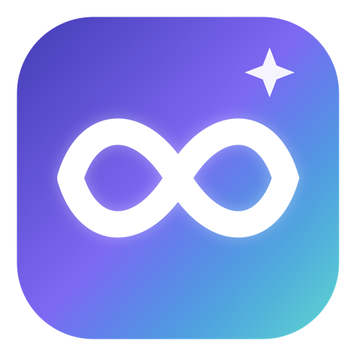
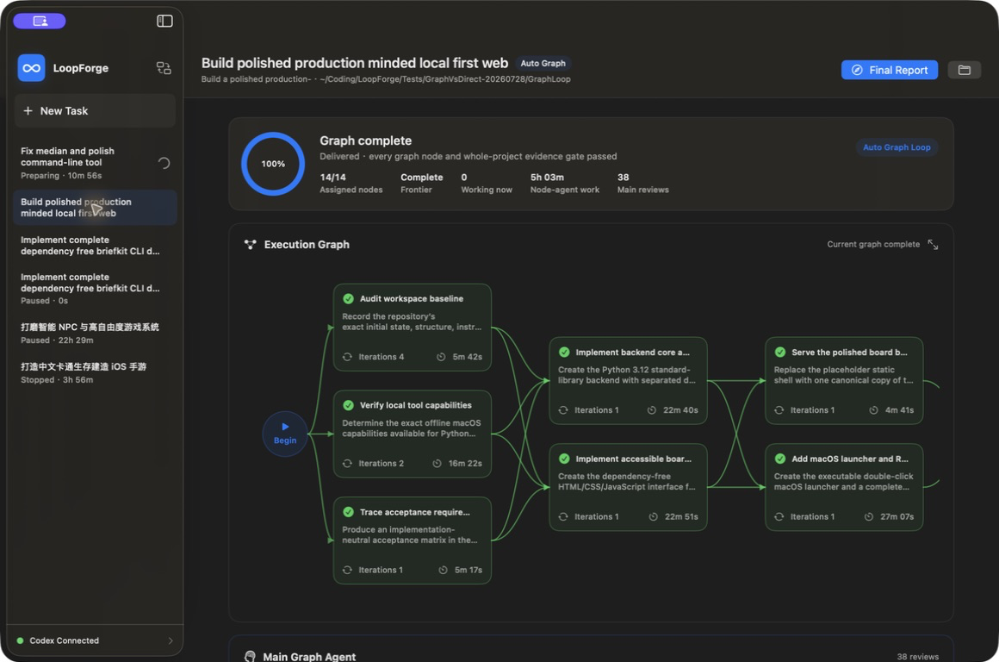
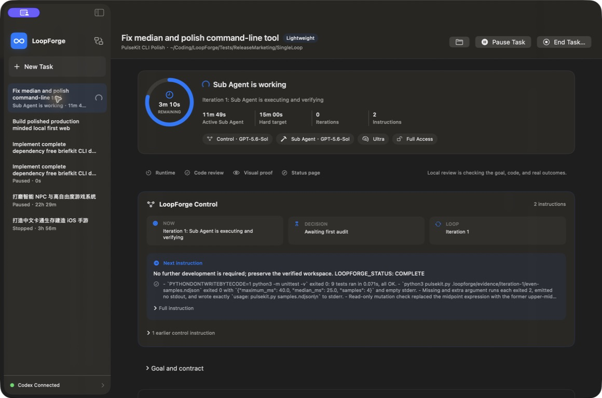
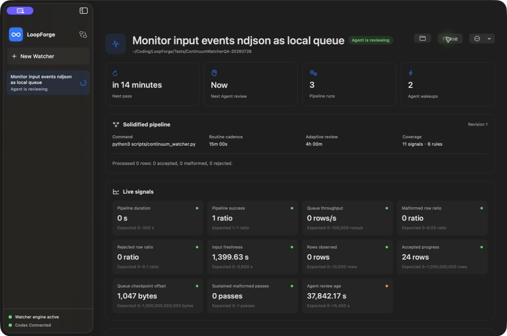
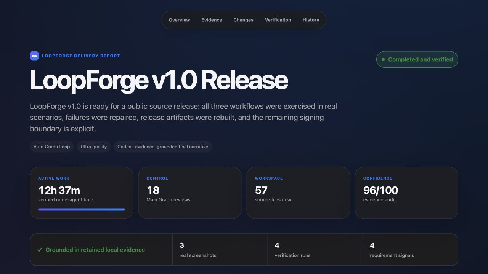
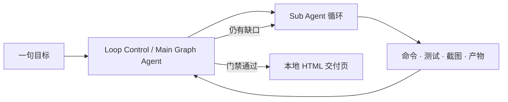

<p align="center">
  
</p>

<h1 align="center">LoopForge</h1>

<p align="center">
  <strong>把一句话变成经过验证的软件，或一条可长期运行的本地自动化管线。</strong><br>
  面向 macOS 的原生自治编程控制台：单 Agent 循环、依赖感知的多 Agent 图，以及可自适应修复的 Watcher。
</p>

<p align="center">
  <a href="README.md">English</a> · <a href="README.zh-CN.md">简体中文</a>
</p>

<p align="center">
  
  
  
  
  
</p>



LoopForge 是一款围绕 Codex Agent 架构构建的原生 macOS 工具，通过全自动
Single Loop、依赖感知 Auto Graph 和自适应 Continuum Watcher 三种 Loop
形态完成超长、复杂任务。安装包已内置官方 Codex 和 Ollama 运行时，同时
支持第三方 API，以及按需下载开源模型到本地运行。

**LoopForge 项目全部开源，采用 Apache 2.0 许可证。**

用户只需给出一个结果目标，LoopForge 就会自动持续规划、执行、审计、恢复
并发出下一步指令，同时保持过程可见、可暂停、可恢复和可检查。它验证真实
命令、产物、测试和截图，并以本地 HTML 交付页结束任务，而不是停在 Agent
的一句“已经完成”。

## 目录

- [为什么使用 LoopForge](#为什么使用-loopforge)
- [三种工作方式](#三种工作方式)
- [任务交付页](#任务交付页)
- [快速开始](#快速开始)
- [运行逻辑](#运行逻辑)
- [关键控制项](#关键控制项)
- [模型隐私与权限](#模型隐私与权限)
- [参与贡献](#参与贡献)

## 为什么使用 LoopForge

- **面向结果，而不是回复。** 硬工作时长、循环审计、真实命令、视觉证据和最终交付门禁共同决定完成。
- **只在安全时并行。** Auto Graph 只有在前驱完成、合并并通过审计后，才会真正创建后继节点。
- **不让 Agent 为等待付费。** Continuum Watcher 把重复工作固化为本地管线，仅在异常、复核、适配或完成时唤醒智能模型。
- **全过程可追溯。** 指令、迭代、检查点、分支替换、阻塞时间和 Main Agent 决策均可查看。

## 三种工作方式

### Single Loop：完成一个明确结果



适合新建项目、修复 Bug、迁移依赖、优化性能、跑实验和补齐测试。LoopForge 持续检查代码与证据，并向 Sub Agent 给出当前价值最高的下一步，直到时间和质量门禁都通过。

示例：修复持久化竞态 · 完成可发布工具 · 复现并优化慢路径 · 建立机器学习 baseline。

如果一个结果不够，可以启用 **Parallel candidates**，选择 **2–8** 份结果。LoopForge 会在彼此隔离的 Git worktree 中完成它们，再由 Agent 根据证据自动保留最佳结果，或交给用户最终选择。

### Auto Graph：协同完成复杂系统


Main Graph Agent 只创建当前可以执行的节点。相互独立的节点可使用 Git worktree 并行；依赖节点要等完整 join group 审计后才会出现。被终止的错误路线仍以红色历史保留，并明确指向替代节点。

示例：后端 + 原生 UI + 数据迁移 · 多模块重构 · 产品、测试、文档和打包协同 · 研究结论收敛到实现。

### Continuum Watcher：自动处理长期工作



Codex 首先把常规部分固化为一次性、幂等、带原子遥测和检查点的程序；轻量调度器负责运行。只有规则、陈旧数据、失败、阈值或周期复核才会唤醒 Agent，分析当前状态并改进管线本身。

示例：服务与安全异常监控 · 大批量数据处理 · 条件达成通知 · 周期性数据质量检查。

## 任务交付页



每个完成任务都会生成一个本地、自包含的 HTML 交付页。首屏先给出结果、有效工作时长与审计置信度，随后依次呈现原始任务、前后变化、项目真实截图、需求证据覆盖、验证命令、已知限制、后续建议和完整控制历史。截图可以放大查看；缺失的证据会被明确标出，不会被模型结论掩盖。

任务顶部的 **Final Report** 可以随时重新打开交付页。由正式渲染器生成的可复现实例位于 [`docs/examples/completion-report`](docs/examples/completion-report)。

## 快速开始

### 1. 安装 LoopForge

以下两种安装方式任选其一：

- **下载应用——推荐。** 在
  [最新 Release](https://github.com/godicewang/LoopForge/releases/latest)
  下载 `LoopForge-macOS-arm64.zip`，解压并把 **LoopForge.app** 拖入
  `/Applications`。安装包已经包含 Codex CLI 和 Ollama 运行时。
- **从源码构建。** 适合开发 LoopForge 本身，需要 Xcode Command Line
  Tools、`curl` 和 Apple Silicon：

  ```bash
  git clone https://github.com/godicewang/LoopForge.git
  cd LoopForge
  zsh Scripts/bootstrap_vendor.sh
  zsh Scripts/package_app.sh
  open dist/LoopForge.app
  ```

源码构建脚本会下载并校验固定版本的官方 Codex 与 Ollama 发行文件；仓库和
应用包均不携带模型权重。
两种方式均要求 Apple Silicon 和 macOS 14 及以上。

当前社区包尚未完成 Apple 公证。用户不需要配置签名；首次打开时 macOS
可能需要执行一次 **按住 Control 点击 → 打开**。

### 2. 选择 Agent 后端

以下三种方式彼此独立，都能使用相同的 LoopForge 工作流：

- **官方 Codex——默认选项，适合要求最高智能体能力的任务。** 无需另行
  安装 Codex。LoopForge 首次启动会自动检查已有 Codex/ChatGPT 登录；如果
  尚未登录，点击 **Connect with ChatGPT**，在浏览器完成官方设备授权即可，
  无需向 LoopForge 填写 API Key。
- **API 模型——适合已有第三方模型账号或需要指定云端模型的用户。** 选择
  Continue with Local or API Models，进入 **Manage Models → API
  Connections**，选择服务商并填写 API Key。密钥只保存在 macOS Keychain，
  模型继续使用相同的 Codex 工具框架和 Loop 控制逻辑。
- **本地模型——适合强调隐私或离线推理的任务。** 选择 Continue with Local
  or API Models，进入 **Manage Models → Local Deployment**，点击下载所需
  模型。Ollama 运行时已经内置，只会额外下载模型权重；无需安装 Ollama，
  也无需登录 Codex。

Loop Control Agent 和 Sub Agent 可以分别选择不同的模型后端。

### 3. 选择工作方式

- **Single Loop：** 面向一个明确构建、修复、优化、实验或 baseline 的
  全自动“执行—审计—继续”循环。
- **Auto Graph：** 面向复杂多模块任务的依赖感知并行 Agent Loop，分阶段
  安全集成并审计后再继续派发。
- **Continuum Watcher：** 面向常驻、批量、长耗时监控或处理任务的本地
  持久管线，只在需要判断或调整时唤醒 Agent。

新建或选择项目，输入一个结果目标，选择 Task Quality 与 Agent 配置，按需
调整建议工作时长，然后启动 Loop。

### 运行测试

```bash
swift test
swift build -c release -Xswiftc -warnings-as-errors
```

## 运行逻辑



只有成功且真正工作的 Sub Agent 时间会计入硬目标。下载、控制审计、基础设施失败、暂停、睡眠和应用离线时间都不会计入。状态使用原子检查点持久化，意外退出后不会虚增工作时长。

Auto Graph 额外保证：所有必需前驱完成、合并并通过 Main Agent 审计前，后继任务不会被派发。Main Agent 使用信号量等待节点，而非长期轮询。

Watcher 每次只执行一个有界确定性 pass 然后退出。遥测、检查点、信号与规则数量、文件大小、子进程输出、超时和工作区路径都受到验证与上限保护。

## 关键控制项

| 控制项 | 作用 |
| --- | --- |
| **Task Quality** | Lightweight、Normal、Enhanced、Ultra 四档证据深度 |
| **Active runtime** | 根据目标建议，开始前可增减 |
| **Single / Graph / Candidates** | 单循环、依赖图或隔离候选结果 |
| **Candidate branches** | 可选 2–8 个隔离 Git worktree，并由 Agent 或用户保留最佳结果 |
| **Loop Control Agent** | 规划、审计、恢复并决定下一条指令 |
| **Sub Agent** | 执行具体项目任务 |
| **Full Access / Workspace Only** | 为两个角色分别设置权限边界 |
| **Pause Task** | 保存检查点并等待进程安全退出 |
| **End Task…** | 停止 Agent，同时保留项目与证据 |
| **Final Report** | 打开包含真实截图与验证证据的本地交付页 |

## 模型隐私与权限

两个角色默认使用 LoopForge 内置或本机已有的官方 Codex CLI 返回的最新
模型、最强可用推理和 Full Access。用户也可以选择：

- 使用 Mac 已有 ChatGPT 身份的官方 Codex；
- 保存的 OpenAI-compatible API；
- 通过 Codex OSS 工具框架工作的 Ollama 本地模型。

API Key 只保存在 macOS Keychain，不进入任务 JSON 或命令参数。Watcher 子进程使用最小环境，不能继承无关 API/CI 密钥。本地模型必须由用户确认下载，并通过大小、能力、摘要与真实响应检查。详见 [SECURITY.md](SECURITY.md)。

## 参与贡献

欢迎提交 Issue 和范围清晰的 Pull Request。请先阅读
[贡献指南](CONTRIBUTING.md)、[安全模型](SECURITY.md) 与
[行为准则](CODE_OF_CONDUCT.md)。

LoopForge 是独立开源项目，并非 OpenAI 或 Ollama 官方产品。第三方组件保留各自许可证，详见 [THIRD_PARTY_NOTICES.md](THIRD_PARTY_NOTICES.md)。
